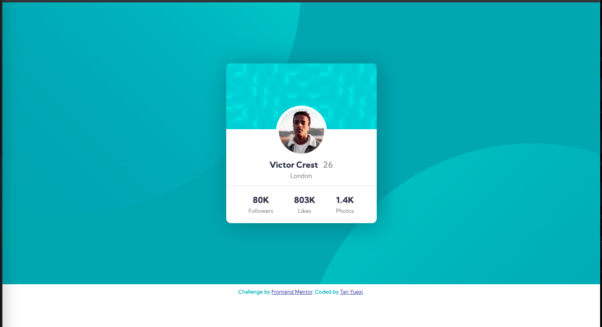

# Frontend Mentor - Profile card component solution

This is a solution to the [Profile card component challenge on Frontend Mentor](https://www.frontendmentor.io/challenges/profile-card-component-cfArpWshJ). Frontend Mentor challenges help you improve your coding skills by building realistic projects.

## Table of contents

- [Overview](#overview)
  - [The challenge](#the-challenge)
  - [Screenshot](#screenshot)
  - [Links](#links)
- [My process](#my-process)
  - [Built with](#built-with)
  - [What I learned](#what-i-learned)
    - [CSS position property](#css-position-property)
    - [CSS display property](#css-display-property)
    - [How to position horizontally and vertically](#how-to-position-horizontally-and-vertically)
    - [How to crop an image to parent div](#how-to-crop-an-image-to-parent-div)
  - [Continued development](#continued-development)
  - [Useful resources](#useful-resources)
- [Author](#author)

## Overview

### The challenge

- Build out the project to the designs provided

### Screenshot

### Links

- Solution URL: <https://github.com/tanyuexi/frontendmentor-profile-card-component>
- Live Site URL: <https://tanyuexi.github.io/frontendmentor-profile-card-component/>

## My process

### Built with

- Semantic HTML5 markup
- CSS custom properties

### What I learned

#### CSS position property

| Value        | Description |
| ------------- | ------------- |
| static | Default value. Elements render in order, as they appear in the document flow |
| absolute | The element is positioned relative to its first positioned (not static) ancestor element |
| fixed | The element is positioned relative to the browser window |
| relative | The element is positioned relative to its normal position, so "left:20px" adds 20 pixels to the element's LEFT position |

Elements of `static` and `relative` position follows the document flow, while those of `absolute` and `fixed` are taken out of the flow, possibly overlapping with other elements.

#### CSS display property

| Value        | Description |
| ------------- | ------------- |
| inline | Displays an element as an inline element (like ``). Any height and width properties will have no effect |
| block | Displays an element as a block element (like `
`). It starts on a new line, and takes up the whole width |
| flex | Displays an element as a block-level flex container |
| inline-block | Displays an element as an inline-level block container. The element itself is formatted as an inline element, but you can apply height and width values |

#### How to position horizontally and vertically

My cheatsheet of centering: [How to Center Anything in CSS](https://tanyuexi.github.io/frontend-mentor-profile-card-component/center-everything.html)

#### How to crop an image to parent div

In parent class: `overflow: hidden;`

### Continued development

Learn about Flex Box and apply it to the website.

### Useful resources

- [W3Schools](https://www.w3schools.com/)

## Author

- Website - [TanYuexi](https://tanyuexi.github.io)
- Frontend Mentor - [@tanyuexi](https://www.frontendmentor.io/profile/tanyuexi)
